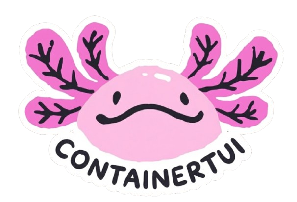

  

 

A terminal-based user interface (TUI) for managing container lifecycles, built on [Moby](https://github.com/moby/moby) and powered by [Bubble Tea](https://github.com/charmbracelet/bubbletea) and excessive coffee consumption.

This repository is currently under heavy development. Expect frequent breaking changes, non-functional components, and incomplete features. This tool is not ready for production use.

## Features

- **Containers** - View, start, stop, restart, and manage Docker containers
- **Images** - View local images, pull new images, and create containers
- **Volumes** - Manage Docker volumes
- **Networks** - Manage Docker networks
- **Services** - View Docker Compose services
- **Browse** - Browse and search Docker Hub, view image details and README files, pull images directly

## Browse Tab

The Browse tab allows you to discover and pull images from Docker Hub without leaving the terminal:

- **Popular Images**: Automatically loads the top 50 official Docker images sorted by pull count
- **Search**: Press `s` to search Docker Hub for any image
- **Image Details**: View comprehensive information including:
  - Pull count, star count, and official status
  - Full README/documentation
  - Last updated and creation dates
- **Pull Images**: Press `p` to pull any image directly to your local Docker daemon
- **Filtering**: Use `/` to filter the current list locally

### Keybindings (Browse Tab)

| Key | Action |
|-----|--------|
| `6` | Switch to Browse tab |
| `s` | Search Docker Hub |
| `p` | Pull selected image |
| `/` | Filter list |
| `space` | Toggle selection |
| `y` | Copy details to clipboard (when detail pane focused) |
| `tab` | Switch focus between list and details |
| `↑/↓` or `j/k` | Navigate |
| `q` | Quit |
